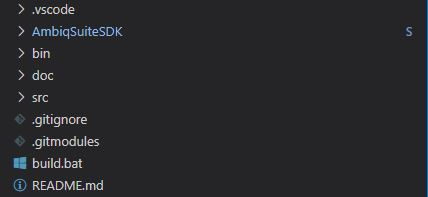
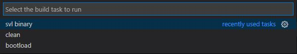

# artemis

Visual Studio Code development environment for [SparkFun Artemis](https://www.sparkfun.com/artemis) based boards.

This project provides a starting template to develop, build, load, and debug SparkFun Artemis based boards using Visual Studio Code in conjunction with a Segger J-Link device. This project natively supports the Windows 10 platform and does ***not*** rely on Windows Subsystem for Linux (WSL), MinGW, etc.

## Dependencies

The latest version of each tool/extension should be used unless otherwise noted. During installation, if the option is available to add a given tool to the PATH environment variable, please do so. This is very important for the GNU Arm Embedded Toolchain.

The following tools are required to make use of this repository:

* [git](<https://git-scm.com/>)
* [GNU Arm Embedded Toolchain](<https://developer.arm.com/tools-and-software/open-source-software/developer-tools/gnu-toolchain/gnu-rm>)
* [Segger J-Link](<https://www.segger.com/downloads/jlink/>)
* [Visual Studio Code](<https://code.visualstudio.com/>)

The following Visual Studio Code extensions are required:

* [C/C++](<https://marketplace.visualstudio.com/items?itemName=ms-vscode.cpptools>)
* [Cortex-Debug](<https://marketplace.visualstudio.com/items?itemName=marus25.cortex-debug>)

The following Visual Studio Code extensions are recommended:

* [ARM](<https://marketplace.visualstudio.com/items?itemName=dan-c-underwood.arm>)
* [LinkerScript](<https://marketplace.visualstudio.com/items?itemName=ZixuanWang.linkerscript>)

## Getting Started

### Clone this repository and initialize its submodules

```shell
git clone https://github.com/0xcart/artemis.git
cd artemis
git submodule update --init --recursive
```

This repository includes the SparkFun copy of the [AmbiqSuite SDK](https://github.com/sparkfun/AmbiqSuiteSDK) as a git submodule. In turn, this copy of the SDK includes the SparkFun [Board Support Package](https://github.com/sparkfun/SparkFun_Apollo3_AmbiqSuite_BSPs) repository as a git submodule. By using the --init --recursive flags both submodules will be initialized and updated correctly.

### Open the project

Launch Visual Studio Code.

Click `File`, `Open Folder...` from the main menu. Select the `artemis` folder and click `Select Folder`. You should now see the following in the `Explorer` view within Visual Studio Code:



### Configure the Cortex-Debug Visual Studio Code extension

Highlight the Cortex-Debug extension in the `Extensions` view within Visual Studio Code. Click the `Manage` (gear) icon. Click the `Extension Settings` option in the displayed popup menu. A `Settings` document will be loaded for the extension.

Click on `Edit in settings.json` which will open the `settings.json` document. Update the settings with the following information taking care the paths for the J-Link GDB server and ARM toolchain are correct for your system configuration.

```json
{
  "editor.tabSize": 2,
  "editor.wordWrapColumn": 120,
  "cortex-debug.JLinkGDBServerPath": "C:/Program Files (x86)/SEGGER/JLink/JLinkGDBServerCL.exe",
  "cortex-debug.armToolchainPath": "C:/Program Files (x86)/GNU Arm Embedded Toolchain/9 2020-q2-update/bin",
  "window.zoomLevel": 0,
}
```

### Update c_cpp_properties.json settings in the .vscode folder

Update the `compilerPath` value to match your system configuration.

### Update launch.json settings in the .vscode folder

Update the `serverpath` value to match your system configuration. Also update the `cpuFrequency`, `swoFrequency`, and `device` values to match your Artemis board.

### Update build.bat

Several parameters in build.bat must be verified and/or updated.

The first set of parameters are associated with your Artemis board. Please update these parameters to match your boards attributes. The default parameters found in build.bat are for the Artemis Thing Plus. If you're using this board then no modification should be necessary.

* BLD_BOARD=artemis_thing_plus
* BLD_PART=APOLLO3
* BLD_MCU=apollo3
* BLD_CPU=cortex-m4
* BLD_FPU=fpv4-sp-d16
* BLD_FABI=hard

The second set of parameters are associated with communications to your board. Please update these as necessary. Note, a baud rate of 921600bps is correct for the SparkFun Variable Loader (SVL).

* BLD_BAUD=921600
* BLD_PORT=COM4

In the future, when you're ready to add additional source files, libraries, etc., you'll need to update the following:

* BLD_INCLUDE=-Imy/include/path
* BLD_SOURCE=src/mysrc.c
* BLD_LIBRARY=mylib.a

## Build, Load, and Debug

Press `F1`. This will display a popup menu listing all commands. Select `Tasks: Run Build Task` from the list of tasks. Alternatively you can press `Ctrl + Shift + B` to reach the same set of build tasks.



To build the project select `svl binary`. You should see the following printed to the console:

```shell
Making    'bin' directory
Compiling 'src/main.c'
Compiling 'AmbiqSuiteSDK/boards_sfe/common/tools_sfe/templates/startup_gcc.c'
Compiling 'AmbiqSuiteSDK/devices/am_devices_led.c'
Compiling 'AmbiqSuiteSDK/utils/am_util_delay.c'
Compiling 'AmbiqSuiteSDK/utils/am_util_stdio.c'
Linking   'bin/output_svl.axf' with script 'AmbiqSuiteSDK/boards_sfe/common/tools_sfe/templates/asb_svl_linker.ld'
Creating  'bin/output_svl.lst'
Creating  'bin/output_svl.bin'

=== BUILD SUCCESSFUL ===
```

A `bin` directory is created containing the following list of output files:

* am_devices_led.o
* am_util_delay.o
* am_util_stdio.o
* main.o
* output_svl.axf
* output_svl.bin
* output_svl.lst
* output_svl.map
* startup_gcc.o

To load `output_svl.bin` onto your Artemis board press `Ctrl + Shift + B` and select `bootload`. This executes the `artemis_svl.exe` process provided by SparkFun and loads the binary via the SparkFun Variable Loader (SVL). You should see the following (or similar) printed to the console:

```shell
Artemis SVL Bootloader

phase:  setup
        cleared startup blip
        Got SVL Bootloader Version: 3
        Sending 'enter bootloader' command

phase:  bootload
        have 4484 bytes to send in 3 frames
        sending frame #1, length: 2048
        sending frame #2, length: 2048
        sending frame #3, length: 388

        Upload complete

        Nominal bootload bps: 36222.77
```

Press `F5`. This will launch the Segger J-Link GDB server.

TODO

To clean the project, again bring up the build task by pressing `Ctrl + Shift + B` and select `clean`. You should see the following printed to the console:

```shell
Removing 'bin' directory
```
