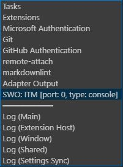

# artemis

A Visual Studio Code development environment for [SparkFun Artemis](https://www.sparkfun.com/artemis) based boards.

This project provides a starting template to develop, build, load, and debug SparkFun Artemis based boards using Visual Studio Code in conjunction with Segger J-Link. This project natively supports the Windows 10 platform and does ***not*** rely on Windows Subsystem for Linux (WSL), MinGW, etc. The batch file, build.bat, which supports building and loading from Windows is modeled after the Makefile template provided in the [SparkFun Board Support Package](https://github.com/sparkfun/SparkFun_Apollo3_AmbiqSuite_BSPs) repository.

While the current configuration supports Segger J-Link, it can be configured to support OpenOCD, etc.

The SparkFun Artemis [forum](https://forum.sparkfun.com/viewforum.php?f=167) is highly recommended for information and support.

In addition to providing a starting template to develop, build, load, and debug with Visual Studio Code, this project also serves as a foundation for a quadruped robot inspired by the work of [Martin Triendl](https://www.youtube.com/watch?v=QWxBLGjrkEU). While the full implementation is maintained in a seperate repository, core components are updated in this repository to provide others a starting point (or at minimum, example code). For instance, the code demonstrates how to control servos using the [PCA9685 Servo Driver](doc/hardware/pca9685/adafruit-16-channel-pwm-servo-driver.pdf) over I2C via the AmbiqSuiteSDK HAL `transfer` functions. It also demonstrates how to read data from an [InvenSense ICM-20649](doc/hardware/icm20649/adafruit-icm20649-wide-range-6-dof-imu.pdf) IMU (accel/gyro) over SPI via the same AmbiqSuiteSDK HAL `transfer` functions.

## Dependencies

The latest version of each tool/extension should be used unless otherwise noted. During installation if the option is available to add a given tool to the system PATH environment variable please do so. This is very important for the GNU Arm Embedded Toolchain.

The following tools are required to make use of this repository:

* [git](<https://git-scm.com/>)
* [GNU Arm Embedded Toolchain](<https://developer.arm.com/tools-and-software/open-source-software/developer-tools/gnu-toolchain/gnu-rm>)
* [Segger J-Link](<https://www.segger.com/downloads/jlink/>)
* [Visual Studio Code](<https://code.visualstudio.com/>)

The following Visual Studio Code extensions are required:

* [C/C++](<https://marketplace.visualstudio.com/items?itemName=ms-vscode.cpptools>)
* [Cortex-Debug](<https://marketplace.visualstudio.com/items?itemName=marus25.cortex-debug>)

The following Visual Studio Code extensions are recommended:

* [ARM](<https://marketplace.visualstudio.com/items?itemName=dan-c-underwood.arm>)
* [LinkerScript](<https://marketplace.visualstudio.com/items?itemName=ZixuanWang.linkerscript>)

## Getting Started

### Clone this repository and initialize its submodules

```shell
git clone https://github.com/0xcart/artemis.git
cd artemis
git submodule update --init --recursive
```

This repository includes the SparkFun copy of the [AmbiqSuite SDK](https://github.com/sparkfun/AmbiqSuiteSDK) as a git submodule. In turn, this copy of the SDK includes the [SparkFun Board Support Package](https://github.com/sparkfun/SparkFun_Apollo3_AmbiqSuite_BSPs) repository as a git submodule. By using the `--init` and `--recursive` flags both submodules will be initialized and updated correctly.

### Open the project

Launch Visual Studio Code.

Click `File`, `Open Folder...` from the main menu. Select the `artemis` folder and click `Select Folder`. You should now see the following in the `Explorer` view within Visual Studio Code:


### Configure the Cortex-Debug Visual Studio Code extension

Highlight the Cortex-Debug extension in the `Extensions` view within Visual Studio Code. Click the `Manage` (gear) icon. Click the `Extension Settings` option in the displayed popup menu. A `Settings` document will be loaded for the extension.

Click on `Edit in settings.json` which will open the `settings.json` document. Update the settings with the following information taking care the paths for the J-Link GDB server and ARM toolchain are correct for your system configuration.

```json
{
  "editor.wordWrapColumn": 120,
  "cortex-debug.JLinkGDBServerPath": "C:/Program Files (x86)/SEGGER/JLink/JLinkGDBServerCL.exe",
  "cortex-debug.armToolchainPath": "C:/Program Files (x86)/GNU Arm Embedded Toolchain/9 2020-q2-update/bin",
  "window.zoomLevel": 0,
}
```

### Update the c_cpp_properties.json settings in the .vscode folder

Update the `compilerPath` value to match your system configuration.

```json
{
  "version": 4,
  "configurations": [
    {
      "name": "gcc-arm",
      "includePath": [
        "${workspaceFolder}/src",
        "${workspaceFolder}/AmbiqSuiteSDK/boards_sfe/artemis_thing_plus/bsp",
        "${workspaceFolder}/AmbiqSuiteSDK/utils",
        "${workspaceFolder}/AmbiqSuiteSDK/devices",
        "${workspaceFolder}/AmbiqSuiteSDK/mcu/apollo3",
        "${workspaceFolder}/AmbiqSuiteSDK/CMSIS/AmbiqMicro/Include",
        "${workspaceFolder}/AmbiqSuiteSDK/CMSIS/ARM/Include"
      ],
      "defines": [],
      "compilerPath": "C:/Program Files (x86)/GNU Arm Embedded Toolchain/9 2020-q2-update/bin/arm-none-eabi-gcc.exe",
      "intelliSenseMode": "gcc-arm"
    }
  ]
}
```

### Update the launch.json settings in the .vscode folder

Update both `serverpath` values to match your system configuration. Also update the `cpuFrequency`, `swoFrequency`, and `device` values to match your Artemis board. For most SparkFun Artemis boards the default values should be correct.

```json
{
  "version": "0.2.0",
  "configurations": [
    {
      "name": "launch",
      "type": "cortex-debug",
      "request": "launch",
      "cwd": "${workspaceRoot}",
      "servertype": "jlink",
      "serverpath": "C:/Program Files (x86)/SEGGER/JLink/JLinkGDBServerCL.exe",
      "interface": "swd",
      "swoConfig": {
        "enabled": true,
        "cpuFrequency": 48000000,
        "swoFrequency": 2000000,
        "source": "probe",
        "decoders": [
          {
            "type": "console",
            "label": "ITM",
            "port": 0,
            "encoding": "ascii"
          }
        ]
      },
      "device": "AMA3B1KK-KBR",
      "svdFile": "${workspaceRoot}/AmbiqSuiteSDK/pack/SVD/apollo3.svd",
      "executable": "${workspaceRoot}/bin/output_svl.axf",
      "runToMain": true,
    },
    {
      "name": "attach",
      "type": "cortex-debug",
      "request": "attach",
      "cwd": "${workspaceRoot}",
      "servertype": "jlink",
      "serverpath": "C:/Program Files (x86)/SEGGER/JLink/JLinkGDBServerCL.exe",
      "interface": "swd",
      "swoConfig": {
        "enabled": true,
        "cpuFrequency": 48000000,
        "swoFrequency": 2000000,
        "source": "probe",
        "decoders": [
          {
            "type": "console",
            "label": "ITM",
            "port": 0,
            "encoding": "ascii"
          }
        ]
      },
      "device": "AMA3B1KK-KBR",
      "svdFile": "${workspaceRoot}/AmbiqSuiteSDK/pack/SVD/apollo3.svd",
      "executable": "${workspaceRoot}/bin/output_svl.axf",
    }
  ]
}
```

### Update build.bat

Several parameters in build.bat must be verified and/or updated.

The first set of parameters are associated with your Artemis board. Please update the values for these parameters to match your boards attributes. The default values found in build.bat are for the Artemis Thing Plus. If you're using this board then no modifications should be necessary. The value for `BLD_BOARD` should match one of the folders found in `artemis/AmbiqSuiteSDK/boards_sfe`.

* BLD_BOARD=artemis_thing_plus
* BLD_PART=APOLLO3
* BLD_MCU=apollo3
* BLD_CPU=cortex-m4
* BLD_FPU=fpv4-sp-d16
* BLD_FABI=hard

The second set of parameters are associated with communications to your board. Please update these values as necessary. A baud rate of 921600bps is correct for the SparkFun Variable Loader (SVL).

* BLD_BAUD=921600
* BLD_PORT=COM4

In the future, when you're ready to add additional source files, libraries, etc., you'll need to update the following parameters:

* BLD_INCLUDE=
* BLD_SOURCE=
* BLD_LIBRARY=

## Build, Load, Debug, and Clean

### Build

Press `F1`. This will display a popup menu listing all commands. Select `Tasks: Run Build Task` from the list of commands to display the build task. Alternatively you can press `Ctrl + Shift + B` to reach the same build task.


To build the project select `svl binary`. You should see the following printed to the console:

```shell
Making    'bin' directory
Compiling 'src/artemis_startup.c'
Compiling 'src/artemis_main.c'
Compiling 'src/artemis_mcu.c'
Compiling 'src/artemis_debug.c'
Compiling 'src/artemis_watchdog.c'
Compiling 'src/artemis_time.c'
Compiling 'src/artemis_scheduler.c'
Compiling 'src/artemis_task.c'
Compiling 'src/artemis_core.c'
Compiling 'src/artemis_led.c'
Compiling 'src/artemis_iom.c'
Compiling 'src/artemis_i2c.c'
Compiling 'src/artemis_spi.c'
Compiling 'src/artemis_stream.c'
Compiling 'src/artemis_pca9685.c'
Compiling 'src/artemis_servo.c'
Compiling 'src/artemis_icm20649.c'
Compiling 'src/artemis_imu.c'
Compiling 'src/artemis_gpio.c'
Compiling 'src/artemis_uart.c'
Compiling 'AmbiqSuiteSDK/devices/am_devices_led.c'
Compiling 'AmbiqSuiteSDK/utils/am_util_delay.c'
Compiling 'AmbiqSuiteSDK/utils/am_util_stdio.c'
Linking   'bin/output_svl.axf' with script 'AmbiqSuiteSDK/boards_sfe/common/tools_sfe/templates/asb_svl_linker.ld'
Creating  'bin/output_svl.lst'
Creating  'bin/output_svl.bin'

=== BUILD SUCCESSFUL ===
```

A `bin` directory is created containing the following list of output files:

* am_devices_led.o
* am_util_delay.o
* am_util_stdio.o
* artemis_core.o
* artemis_debug.o
* artemis_gpio.o
* artemis_i2c.o
* artemis_icm20649.o
* artemis_imu.o
* artemis_iom.o
* artemis_led.o
* artemis_main.o
* artemis_mcu.o
* artemis_pca9685.o
* artemis_scheduler.o
* artemis_servo.o
* artemis_spi.o
* artemis_startup.o
* artemis_stream.o
* artemis_task.o
* artemis_time.o
* artemis_uart.o
* artemis_watchdog.o
* output_svl.axf
* output_svl.bin
* output_svl.lst
* output_svl.map

### Load

To load `output_svl.bin` onto your Artemis board press `Ctrl + Shift + B` and select `bootload`. This executes the `artemis_svl.exe` process provided by SparkFun and loads the binary via the SparkFun Variable Loader (SVL). You should see the following (or similar) printed to the console:

```shell
Artemis SVL Bootloader

phase:  setup
        cleared startup blip
        Got SVL Bootloader Version: 3
        Sending 'enter bootloader' command

phase:  bootload
        have 18792 bytes to send in 10 frames
        sending frame #1, length: 2048
        sending frame #2, length: 2048
        sending frame #3, length: 2048
        sending frame #4, length: 2048
        sending frame #5, length: 2048
        sending frame #6, length: 2048
        sending frame #7, length: 2048
        sending frame #8, length: 2048
        sending frame #9, length: 2048
        sending frame #10, length: 360

        Upload complete

        Nominal bootload bps: 38021.17
```

### Debug

To begin debugging press `F5`. This will launch the Segger J-Link GDB server. Your application will stop at a breakpoint in `main()`:


You should see the following printed to the `DEBUG CONSOLE` tab at the bottom of Visual Studio Code:

```shell
Please check OUTPUT tab (Adapter Output) for output from C:/Program Files (x86)/SEGGER/JLink/JLinkGDBServerCL.exe
Launching server: "C:/Program Files (x86)/SEGGER/JLink/JLinkGDBServerCL.exe" "-if" "swd" "-port" "50000" "-swoport" "50001" "-telnetport" "50002" "-device" "AMA3B1KK-KBR"
Launching GDB: "C:\Program Files (x86)\GNU Arm Embedded Toolchain\9 2020-q2-update\bin\arm-none-eabi-gdb.exe" "-q" "--interpreter=mi2"
undefinedC:\Program Files (x86)\GNU Arm Embedded Toolchain\9 2020-q2-update\bin\arm-none-eabi-gdb.exe: warning: Couldn't determine a path for the index cache directory.
Reading symbols from C:\Solutions\artemis/bin/output_svl.axf...
main () at src/artemis_main.c:17
17      artemis_mcu_initialize();
Not implemented stop reason (assuming exception): undefined
Resetting target
Resetting target
SWO enabled successfully.

Temporary breakpoint 1, main () at src/artemis_main.c:17
17      artemis_mcu_initialize();
```

At the top of Visual Studio Code you'll find a popup dialog with Debug buttons that include `Continue`, `Step Over`, `Step Into`, `Step Out`, etc.:


Click the `Continue` button.

At the bottom of Visual Studio Code you'll find several output consoles:


Click on the `OUTPUT` tab. By default, `Adapter Output` is selected in the drop-down menu on the right:


You should see the following (or similar) printed to the `OUTPUT` tab:

```shell
...
Reading register (d11 = 0x       0)
Reading register (d12 = 0x       0)
Reading register (d13 = 0x       0)
Reading register (d14 = 0x       0)
Reading register (d15 = 0x       0)
```

In the drop down menu on the right (the selection is currently `Adapter Output`) select `SWO: ITM [port: 0, type: console]`:



You should see the following (or similar) printed to the `OUTPUT` tab:

```shell
[2020-08-27T19:45:44.753Z]   SWO ENABLED
```

This verifies functions like `am_util_stdio_printf()` are working properly.

It's worth noting there are two debug run configurations `launch` and `attach`. On the left menu bar click the `Run` icon:


At the top of the `Run` view you will find a drop-down menu that lets you select `launch` or `attach`:


Selecting `launch` will restart your application and stop in `main()` (as described above). Selecting `attach` will attach to your currently running application and stop at the instruction currently being executed. After selecting and executing one of these configurations pressing `F5` will subsequently default to that configuration.

### Clean

To clean the project, again bring up the build task by pressing `Ctrl + Shift + B` and select `clean`. You should see the following printed to the console:

```shell
Removing 'bin' directory
```

## Configuration

As described in the introductory section, this repository supports a quadruped robot. As such it includes code to control servos using the [PCA9685 Servo Driver](https://www.adafruit.com/product/815) over I2C via the AmbiqSuiteSDK HAL `transfer` functions. The PCA9685 I2C implementation is configured to use the QWIIC connector on an Artemis Thing Plus. If you're using a different Artemis board you should confirm or modify these settings as described in the remainder of this section.

### Input/Output Master (IOM)

Open the `am_bsp_pins.h` file located in `artemis/AmbiqSuiteSDK/boards_sfe/<your board>/bsp`. Here you will find the definition of allowable pin configurations including those for I2C and SPI which are grouped as "modules" from `IOM0` to `IOM5` (there could be more or less depending on your board). Now review the function `artemis_pca9685_initialize()` found in [artemis_pca9685.c](src/artemis_pca9685.c). It includes the following code:

```C
i2c->iom.module = ARTEMIS_IOM_MODULE_I2C0; // QWIIC
i2c->iom.config.eInterfaceMode = AM_HAL_IOM_I2C_MODE;
i2c->iom.config.ui32ClockFreq = AM_HAL_IOM_400KHZ;
artemis_iom_initialize(&i2c->iom);
am_hal_gpio_pinconfig(AM_BSP_GPIO_IOM4_SCL, g_AM_BSP_GPIO_IOM4_SCL);
am_hal_gpio_pinconfig(AM_BSP_GPIO_IOM4_SDA, g_AM_BSP_GPIO_IOM4_SDA);
```

The first line in the above code snippet specifies which IOM module to use. In this case, `ARTEMIS_IOM_MODULE_I2C0`, which is a constant with a value of `4`. This constant is defined in the enumeration `artemis_iom_module_t` found in [artemis_iom.h](src/artemis_iom.h). The purpose of this enumeration is to specify which IOM modules (0 through 5) to use for the respective I2C and SPI interfaces on your board. The `QWIIC` connector on the Artemis Thing Plus uses `IOM4`. Change the value (if required) for each of these enumerations to conform to the desired IOM module as defined in the `am_bsp_pins.h` file.

```C
typedef enum e_artemis_iom_module_t
{
    ARTEMIS_IOM_MODULE_I2C0 = 4, // QWIIC
    ARTEMIS_IOM_MODULE_I2C1 = 3, // Pins: 17/SCL, 16/SDA
    ARTEMIS_IOM_MODULE_SPI0 = 0  // Pins: 13/SCK, 12/MISO, 11/MOSI
} artemis_iom_module_t;
```

You can also add an enumeration. For example, you can add `ARTEMIS_IOM_MODULE_SPI1` to the `artemis_iom_module_t` enumeration with a value that matches the desired IOM module. When doing so you need to consult the [schematic](doc/hardware/artemis/ArtemisThingPlusSchematic.pdf) for your board (I've linked to the schematic for the Artemis Thing Plus). Let's look at the SPI declarations for `IOM1` in `am_bsp_pins.h` for the Artemis Thing Plus:

```C
//*****************************************************************************
//
//  IOM1_MISO pin: I/O Master 1 SPI MISO signal.
//
//*****************************************************************************
#define AM_BSP_GPIO_IOM1_MISO           9
extern const am_hal_gpio_pincfg_t       g_AM_BSP_GPIO_IOM1_MISO;

//*****************************************************************************
//
//  IOM1_MOSI pin: I/O Master 1 SPI MOSI signal.
//
//*****************************************************************************
#define AM_BSP_GPIO_IOM1_MOSI           10
extern const am_hal_gpio_pincfg_t       g_AM_BSP_GPIO_IOM1_MOSI;

//*****************************************************************************
//
//  IOM1_SCK pin: I/O Master 1 SPI SCK signal.
//
//*****************************************************************************
#define AM_BSP_GPIO_IOM1_SCK            8
extern const am_hal_gpio_pincfg_t       g_AM_BSP_GPIO_IOM1_SCK;
```

Note the pin values specified for MISO, MOSI, and SCK respectively. These are pins on the Artemis (mcu) module. Consulting the [schematic](doc/hardware/artemis/ArtemisThingPlusSchematic.pdf), the Artemis module is depicted on the bottom left of page 1 and titled `Artemis (Apollo3)`. You'll find pins 9, 10, and 8 shown as D9, D10, and D8. You'll also find they're not mapped to board pins on the Artemis Thing Plus. Thus you cannot use `IOM1` for an additional SPI interface. Let's try `IOM2`:

```C
//*****************************************************************************
//
//  IOM2_MISO pin: I/O Master 2 SPI MISO signal.
//
//*****************************************************************************
#define AM_BSP_GPIO_IOM2_MISO           25
extern const am_hal_gpio_pincfg_t       g_AM_BSP_GPIO_IOM2_MISO;

//*****************************************************************************
//
//  IOM2_MOSI pin: I/O Master 2 SPI MOSI signal.
//
//*****************************************************************************
#define AM_BSP_GPIO_IOM2_MOSI           28
extern const am_hal_gpio_pincfg_t       g_AM_BSP_GPIO_IOM2_MOSI;

//*****************************************************************************
//
//  IOM2_SCK pin: I/O Master 2 SPI SCK signal.
//
//*****************************************************************************
#define AM_BSP_GPIO_IOM2_SCK            27
extern const am_hal_gpio_pincfg_t       g_AM_BSP_GPIO_IOM2_SCK;
```

Again, consult the schematic. D25, D28, and D27 on the Artemis module are mapped to D0, D8, and D7 respectively. Now look at the diagram on the bottom right of page 1 titled `Headers`. You'll find D0, D8, and D7 mapped to board pins 14, 5, and 6. Here is a picture of the back of the Artemis Thing Plus. Pin 14 is labelled 0/RX1. Pins 5 and 6 are labelled as such.


The resulting update to `artemis_iom_module_t` in [artemis_iom.h](src/artemis_iom.h) would look like this:

```C
typedef enum e_artemis_iom_module_t
{
    ARTEMIS_IOM_MODULE_I2C0 = 4, // QWIIC
    ARTEMIS_IOM_MODULE_I2C1 = 3, // Pins: 17/SCL, 16/SDA
    ARTEMIS_IOM_MODULE_SPI0 = 0, // Pins: 13/SCK, 12/MISO, 11/MOSI
    ARTEMIS_IOM_MODULE_SPI1 = 2  // Pins: D7/SCK, D0/MISO, D8/MOSI
} artemis_iom_module_t;
```

The final step is to configure each of the pins to the desired function. For convenience, here again is the code snippet from `artemis_pca9685_initialize()` found in [artemis_pca9685.c](src/artemis_pca9685.c):

```C
i2c->iom.module = ARTEMIS_IOM_MODULE_I2C0; // QWIIC
i2c->iom.config.eInterfaceMode = AM_HAL_IOM_I2C_MODE;
i2c->iom.config.ui32ClockFreq = AM_HAL_IOM_400KHZ;
artemis_iom_initialize(&i2c->iom);
am_hal_gpio_pinconfig(AM_BSP_GPIO_IOM4_SCL, g_AM_BSP_GPIO_IOM4_SCL);
am_hal_gpio_pinconfig(AM_BSP_GPIO_IOM4_SDA, g_AM_BSP_GPIO_IOM4_SDA);
```

The final two lines configure the pins on the Artemis module. The constants and variables are those we just reviewed in `am_bsp_pins.h`. Again, they should conform to the IOM module being used. In this case, `IOM4`, which matches the value of the enumeration `ARTEMIS_IOM_MODULE_I2C0`.
